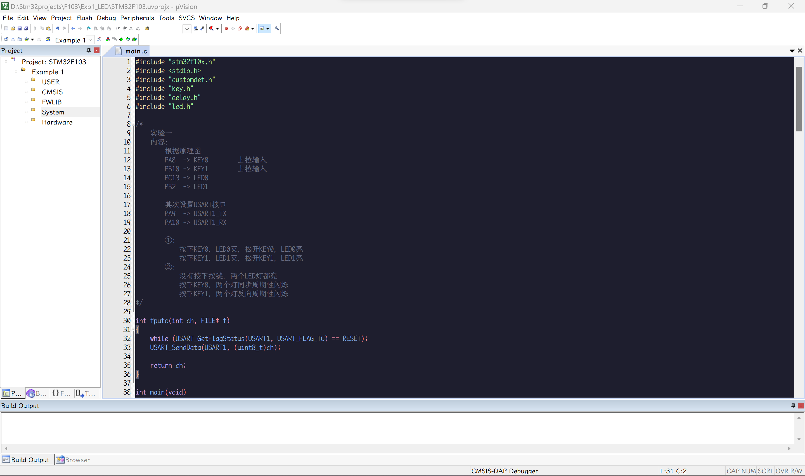

# Keil-Theme-Catppuccin
## 一、效果展示

Keil C/C++ editor theme based on Cappuccin-Mocha

## 二、使用方法

+ 进入 **Keil v5** 安装目录，形如 **X:\Keil_v5\UV4**
+ 找到 **global.prop** 文件并备份
+ 下载本仓库里的 [**global.prop**](./global.prop) 文件，放到上述目录里
+ 重启 **Keil v5**

## OTHER

[**Catppuccin** 官方项目地址](https://github.com/catppuccin/catppuccin)